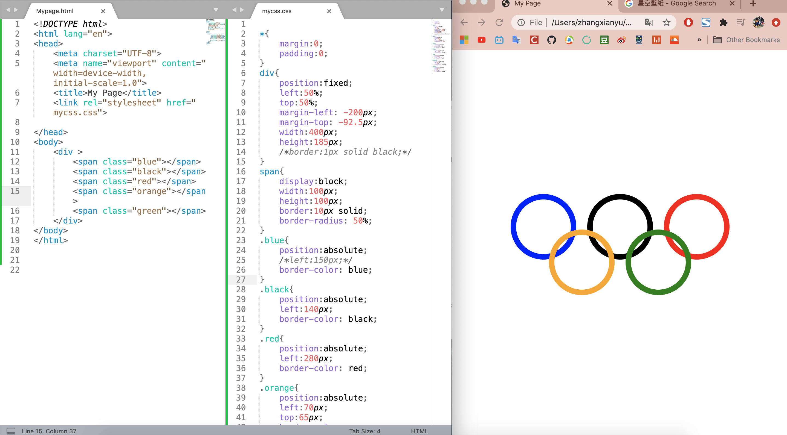

# H5笔记

### 重点1：所有css文件，开头必须包含：

```css
*{
  margin:0;
  padding:0;
}
```

重点2：现实开发方法：先定义css功能，再写html框架。

### 练习1：模仿新浪搜索框

```html
<form action="" method="get">
		
		<input type="text" name="search" value="请输入关键字" onfocus="if(this.value=='请输入关键字'){this.value=''}" onblur="if(this.value==''){this.value='请输入关键字'}">
		<input type="submit" value="search">
			
	</form>
```

第一步，实现鼠标点击搜索框时显示value提示信息，和移开时的区别。

第二步，颜色。

```html
<form action="" method="get">
		
		<input type="text" name="search" value="请输入关键字" style="color:#999" onfocus="if(this.value=='请输入关键字'){this.value='';this.style.color='#424242'}" onblur="if(this.value==''){this.value='请输入关键字';this.style.color='#999'}">
		<input type="submit" value="search">
			
</form>
```

### 作业2：制作奥运五环，固定在屏幕中间

```html
<!DOCTYPE html>
<html lang="en">
<head>
	<meta charset="UTF-8">
	<meta name="viewport" content="width=device-width, initial-scale=1.0">
	<title>My Page</title>
	<link rel="stylesheet" href="mycss.css">
	
</head>
<body>
	<div >
		<span class="blue"></span>
		<span class="black"></span>
		<span class="red"></span>
		<span class="orange"></span>
		<span class="green"></span>
	</div>
</body>
</html>
```

```css
*{
	margin:0;
	padding:0;
}/*所有css的开头都要写这个代码，本文之后为了节省篇幅，不再重复写。*/
div{
	position:fixed;
	left:50%;
	top:50%;
	margin-left: -200px;
	margin-top: -92.5px;
	width:400px;
	height:185px;
	/*border:1px solid black;*/
}
span{
	display:block;
	width:100px;
	height:100px;
	border:10px solid;
	border-radius: 50%;
}
.blue{
	position:absolute;
	/*left:150px;*/
	border-color: blue;
}
.black{
	position:absolute;
	left:140px;
	border-color: black;
}
.red{
	position:absolute;
	left:280px;
	border-color: red;
}
.orange{
	position:absolute;
	left:70px;
	top:65px;
	border-color: orange;
}
.green{
	position:absolute;
	left:210px;
	top:65px;
	border-color: green;
}
```

思考：为什么有了父级div之后，span都基于div来定位。

**为什么直接span会变成实心圆？而且变小，哦，因为是span** 应该用div嵌套。

#### 待办：

- [ ] 思考清楚定位关系。
- [ ] 写出更好更优雅的写法。
- [ ] 复习和调整笔记。



笔记：

先写circle共同特征（position：absolute - 跟随父级absolute或relative或fixed定位，没有的话根据网页定位），然后单独写每一个circle的颜色和位置。然后写父级div的属性：一开始没写position，div并不会被圆环撑开，因为圆环是absolute - 脱离原来定位，进入新层。把父级div定位写成`position: relative;` 就可以实现圆环内容填充在div里面。

但我们需要把父级div固定在中央，所以要用absolute或fixed。absolute - 基于页面居中，上下不居中。fixed永远固定在屏幕中间。

### 作业3：两边栏

```html
<div class="right"></div>
<div class="left"></div>
```

html先写右边再写左边，因为如果是先左后右，而右边是absolute，那么如果左边栏先占一行，右边栏占第二行，虽然absolute是脱离原来位置，但它出生的位置是第二行，会导致两行不能在同一行出现。

所以两边栏，必须先写定位的元素，再写其他元素。

```css
.right{
	position: absolute;
	right:0;
	width: 100px;
	height: 100px;
	background-color: red;
	/*opacity: 0.5;*/
}
.left{
	margin-right: 100px;
	height: 100px;
	background-color: black;
}
```

### 作业4：解决margin塌陷 - 关于margin-top的bug

> 父子嵌套的元素，垂直方向的margin，二者会一起取最大值。

已知两个方块：

```html
<div class="father">
		<div class="kid"></div>
</div>
```

```css
.father{
	width: 100px;
	height: 100px;
	background-color: black;
  /*	margin-top: 100px;
	margin-left: 100px;*/
}
.kid{
	width: 50px;
	height: 50px;
	background-color: red;
}
```

如果给父亲设置margin-left和top分别100px，则kid也跟随父亲移位。此时如果给kid加一个margin-left 50px，则kid相对父亲左侧，右移了50px。

**bug：**但是如果给kid加一个margin-top 50px，则kid无动于衷。直到kid的margin-top的值大于father的margin-top，此时father和kid会一起下移。

##### 解决方法：

1. 给父亲加一个border-top或border，那么kid会根据father border-top的位置定位自己的margin起始位置。（此方法不好，不专业）
2. **bfc - block format context 快级格式上下文。**能改变一个盒子的渲染规则。改变一点。
   * **如何触发一个盒子的bfc：**
     * position: absolute
     * display: inline-block;
     * float: left/right;
     * overflow: hidden;  溢出部分隐藏。
   * so, 如何利用bfc解决**margin塌陷**问题？
     * 改变父级盒子的渲染规则：father{overflow: hidden;} 此时kid就会根据father的边界来进行定位，而不需要多一个像素的border。
     * 以上**四种**bfc的方法都行。
     * 但是，任何一种都不是完美的，根据需求，选择影响最少的一个方法。

3. **margin合并问题。**再比如一个问题：两个span相连，各自有一个margin-right 和margin-left，那么它们之间的距离是二者之和。这是正常情况。而两个div相连，各自有一个margin-bottom和margin-top，但它们之间的距离，却是取最大值。这个问题，也由bfc解决。
   * 解决方法：在第二个div外面套一个盒子div，并且设置这个盒子的css属性：overflow:hidden; 那么这个问题就解决了。或把二者都包含在盒子div里。

4. 总结：margin塌陷，加css就可以。margin合并，加html+css。但是注意，在开发中，不要随便加html结构。那margin合并怎么办？ 不解决。用数学计算来弥补这个问题。

### 作业5：模仿天猫搜索栏

第一步：html: 一个ul和三个list

```html
<ul class="nav">
		<li class="list">天猫</li>
		<li class="list">聚划算</li>
		<li class="list">天猫超市</li>
</ul>
```

第二步：css中，消除list的点

```css
.nav{
  list-style:none;
}
```

第三步：list横过来排列，css中

```css
.nav .list{   /*父子选择器*/
  float:left;
}
```

第四步：设置list之间的间距

```css
.nav .list{
  float:left;
  margin:0 10px;  /*上下0  左右10px*/
}
```

第五步：每个list里面都应包含一个链接a标签（#占位，如果href为空，则文字链接为紫色，如果占位，则为蓝色）

```html
<ul class="nav">
		<li class="list"><a href="#">天猫</a></li>
		<li class="list"><a href="#">聚划算</a></li>
		<li class="list"><a href="#">天猫超市</a></li>
</ul>
```

第六步：给list设置高度，并让文字上下左右居中——左右用text-align:center; 上下用line-height:容器height。

```css
.nav .list{
  float:left;
  margin:0 10px;
  height: 30px;
  text-align: center;
  line-height: 30px;
  /*border:1px solid black;*/
}
```

第七步：去掉a标签的下划线

```css
a{
	text-decoration: none;
}
```

第八步：a标签里文字的颜色调整为淘宝色。但不要再.a里设置，单独设置

```css
.nav a{
  color:#f40;
  font-weight: bold;
}
```

第九步：让网站的所有字体统一

```css
*{
	margin:0;
	padding:0;
	font-family: arial;
}
```

第十步：当鼠标移入，用伪类。

```css
.nav .list a:hover{
	background-color:#f40; 
	color:#fff;
}
```

此时的问题是，移入后，a标签的高度很低。需要调整a标签的高度。

```css
.nav .list a{
  color:#f40;
  font-weight: bold;
  height:30px;   /*设置a标签高度，没用，因为它是行级元素(inline),要把它改成block元素或inline-block*/
  border-radius: 15px;
}
/*所以还要加上一句：*/
.nav .list a{
  display:block;
}
```

第十一步：把hover时的文字背景加宽——给a标签加padding（不需要给list加，a可以把它撑大）

```css
.nav .list a{
	display: block;
	padding:0 5px;
  color:#f40;
  font-weight: bold;
  height:30px;
  border-radius: 15px;
}
```

第十二步：浮动流清除。

* **浮动流**产生的**效果**是: 但凡写到它后面的元素，都会排到其后面。
* 所以每次写完浮动流，都要消除它。用伪元素。

```css
.nav::after{
	content:"";
	display:block;
	clear:both;
}/*必须记住*/
```

### 作业6：写淘宝网商标图

淘宝网的商标图放在a标签里，那么，要把a标签改成块级元素才可以设置宽高。

```css
a{/*先去掉a标签的所有样式特性*/
	display: inline-block;
  text-decoration:none; 
  color:#424242;
  
	height: 50px;
	width: 100px;
	background-image: url(2.png);
	background-size: 100px 50px;
}
```

