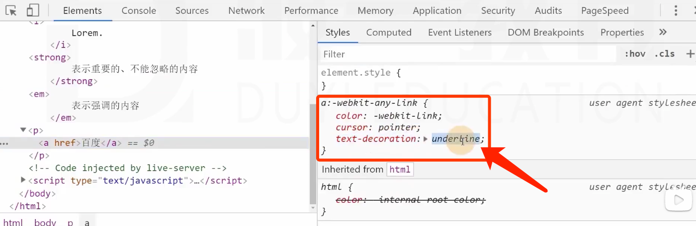
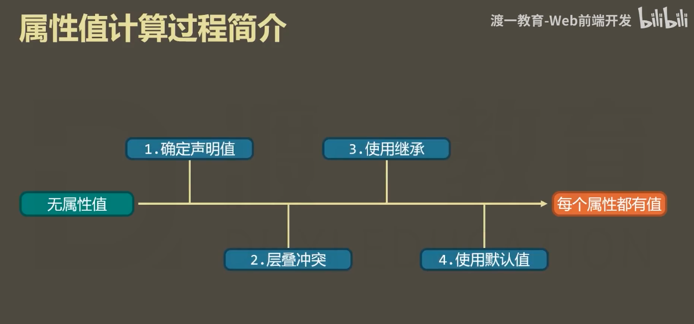

> [扩展]课程：82原则。可以不看，看了会提高竞争力

HTML: hypertext markdown language 超文本标记语言 —— 定义网页中有什么

CSS : Cascading style sheet 层叠样式表 —— 网页内容长什么样子

##### 如何学习？

1. **心态平和。经年累月。**
   * 精益求精，不要操之过急。
   * 学技术，要有过日子的心。
2. **多练习。**
   * 练习的时间 > 听课的时间，**每节课的东西，再简单也要【练习】**。
   * 基础不扎实，只会越学越恼火。

3. 学习顺序。
   * 上一个没有理解清楚，就琢磨透了再往下走。
   * HTML讲一点 -> CSS（HTML补充知识）    CSS相对复杂

## 笔记2 

术语：降低沟通成本。

1. **W3c.org**  万维网联盟，非营利性组织，为互联网提供各种标准。
2. **XML**: extension markup language 可扩展标记语言，用于定义**文档**结构。（html很多继承了它的标签）（标签可自定义）
3. **HTML**: w3c组织定义的语言标准：HTML是用来描述**页面结构**的语言。

4. **css**：w3c定义的语言标准：描述**页面的展示**。

> HTML、CSS —> 浏览器执行 —> 页面
>
> 手机：HTML、CSS —> 浏览器内核 —> 页面 (微信小程序如何运行h&c? 微信里安装了浏览器内核)

5. **浏览器**包括：
  
   * 外壳
   * core
     * core包括 JS引擎 和 渲染引擎。
   * 常见浏览器极其内核
     * IE：Trident
     * Google Chrome：Webkit / Blink(现在)
     * Firefox：Gecko
     * Safari：Webkit
     * Opera：Presto / Blink(现在)
6. H&C的**版本和兼容性**：HTML5、CSS3 
   * HTML5：2014年制定，大部分能识别标准
   * CSS3目前还没有完成。本课程讲css，而不是css3
   * XHTML：可以认为是HTML的一个版本，完全符合XML规范。（基本已经退出历史舞台）

7. 编辑器：VScode 推荐插件：
   * Vscode-icon-mac
   * Live server: 直接运行代码。右键+open with live server —> 代码运行，每次修改保存后，网页自动更新

   * Markdown插件：
     * paste image: 快速复制图片
     * markdown preview enhanced: 预览、[toc]自动生成目录
   
   9. Emit插件：自动生成HTML代码

# HTML核心
## 1. 元素 element
其他叫法：标签、标记

> **元素 = 起始标记(begin tag) + 结束标记(end tag) + 元素内容 + 元素属性**

1. **元素内容**往往是网页要显示的内容
2. **元素属性**描述元素的额外信息
   * > **属性 = 属性名 + 属性值**
   * > **属性的分类**：
     > * 局部属性：某些元素特有的属性
     > * 全局属性：所有元素通用。eg：如下两个标签中，都可以用title属性——鼠标移到文字上时展示title信息
      ```html
      <a href="" title="my first page">my page</a>
      <div title="a word"> document</div>
      ```
3. 有些元素没有结束标签——**空元素**
4. 元素的嵌套
   * 原则：元素不能相互嵌套 eg：`<div><p></div></p>`
   * 父元素，子元素。祖先元素，后代元素。兄弟元素：拥有同一个父元素的元素。

## 2. 标准文档结构
   ```html
   <!DOCTYPE html>
   <html lang="en">
   <head>
      <meta charset="UTF-8">
      <meta name="viewport" content="width=device-width, initial-scale=1.0">
      <title>My Page</title>
   </head>
   <body>

   </body>
   </html>
   ```
1. `<!DOCTYPE html>` **文档声明。** 声明当前文档的HTML标准是H5。
  
   * 如果不写文档声明，将导致浏览器进入怪异渲染模式
2. `<html lang="en"></html>` **根元素。**
   * 一个页面最多只能有一个。它是其他元素的父元素或祖先元素。
   * H5中可以不用写，但是在XHTML里必须明确给出。
   * lang属性：language，全局属性。表示该元素内部使用的文字是哪一种自然语言。
      * 中文zh-cn已过时，现在的写法：`lang="cmn=hans"` 
3. `<head></head>` **文档头。**
   a. `<meta>` **文档的元信息** ：网页的附属信息，用于告诉浏览器。
      * `<meta charset="utf-8">`：指定网页内容编码。
        
         > 在计算机中，低压电（0 ~ 2V)表示为0，高压电（2 ~ 5V)表示为1。二进制。计算机中只存储数字，文字和数字对应。
         > 该字典叫做字符编码表。中国的汉字编码表叫GB2312，台湾是GBK。
      * utf-8 是 Unicode编码的一个版本。Unicode是万国码。
      * `<meta name="viewport" content="width=device-width, initial-scale=1.0">` 用于适配窗口
   
   b. `<title></title>`：网页标题
4. `<body></body>` **文档体**，所有网页中显示的内容，都要放在文档体里
## 3. 语义化 —— H5非常强调这一点
> **语义化：**
> 1. **每个HTML元素都有具体的含义。**
> 2. **所有元素与展示效果无关:**
>     * 元素决定了里面的内容具备什么样的含义（比如`<h1 tyle="font-weight:normal">标题</h1>`，它依然是h1，但它看起来没有加粗）。
>     * 元素展示到页面的效果，由css决定。
>     * 因为浏览器带有默认的css样式，所以每个元素有一个默认的样式
> 3. **选择什么标签取决于内容的含义，而不能因为其样式。** 比如，你要写一个标题，就要用h标签，而写一个加大加粗的字，就不能用h。**我们只能因为文本是什么性质（含义）而选择什么标签，而不能因为文本的样式而决定用什么标签，因为样式完全由CSS决定。** H5对此非常强调。

##### 为什么需要语义化？
1. 为了搜索引擎优化（SEO）
   * 搜索引擎：Google，百度，Bing等等
   * 搜索引擎工作原理：每隔一段时间，引擎会从互联网中抓取一些网页（实际是页面代码），它会根据html语言结构来判断/理解网站内容，确定其关于什么内容。
2. 为了让浏览器理解网页
   * 阅读模式、语音模式等功能，当浏览器对网页理解越深入，表现越好。比如，这些模式中，p标签一定不会忽略，而div等可能会忽略。


## 4. 文本元素
HTML5中支持的元素：H5元素周期表


##### ❤ [ h1 ~ h6 ] 标题head
用语义去理解这些标题，不要用样式去理解

##### ❤ [ p ] 段落paragraph
用于包含段落文本

##### ❤ [ span ] 没有语义，仅用于设计样式
> 以前，
> 独占一行，叫块级元素。
> 不独占一行，叫行级元素/行内元素。
> 到了**HTML5已经弃用这种说法**：H5用**文本类别**代替。why？因为行级块级只是展示效果，我们不应该用效果来定义。

##### ❤ [ pre ] 预格式化文本元素 - 也是一个无语义元素
空白折叠：在源代码中**连续的空白字符（空格、回车、指标tab）**，在页面显示时，会被**折叠为一个空格**。
   * 好处是：把源代码空白和页面空白区分开。
   * 例外：pre元素。

在pre元素中，内容不会出现空白折叠，会按照源代码格式展示。
* 通常用于在网页中显示代码。
* pre元素功能的本质：它有一个默认的css属性 `white-space:pre;`
* 一般在使用pre标签时，外面套一个code标签，表示代码区域。
   ```html
   <code>
      <pre>
         var log(){
            hello;
         }
      </pre>
   </code>
   ```

## 5. HTML Entity：HTML实体 —— 页面中的特殊符号
格式：
1. `&单词;` （两种格式都有对应，但单词法用得最多）
2. `&#数字;`

|特殊符号| 单词格式 |  含义  |
|:-----:|:------:| :------:|
| `<`   | `&lt;` | less than |
| `>`   | `&gt;` | greater than |
| space |`&nbsp;`| none-breaking space |
| `©`   |`&copy;`| 版权符号 |
| `&`   |`&amp;` |         |
| `"`   |`&quot;`|  quote  |

## 6. a元素 - 超链接
js也可以实现跳转，但是多数时候，简单的跳转都是超链接实现。

#### href属性 - 超级引用

**hyper reference 超级引用**，表示：

1. 普通链接。跳转到**地址**：`<a href="http://www.baidu.com“>谷歌</a>`; (注意，把http头写上；可以挂羊头卖狗肉)

2. 锚链接。跳转到某个**锚点**：`<a href="#anIdName“>位置名/锚点名</a>` **（方法：锚点位置加id，a标签href=id）**

   * 回到顶部：`href="#"`
   * 跳到另一个页面的第三章：`href="yourPage.html#chapter3"`
   * 锚点跳转的结果是，也会改变导航栏地址：Mypage.html —> Mypage.html/#chapter2
   * **[ id ] 是一个全局属性，表示元素在文档中的唯一编号。**

   > #### 🎯 练习：跳转锚点——文章有6个章节，利用目录跳转到相应位置。
   >
   > i. 快捷方式生成6个章节的标题和文本: `((h1>{章节$})+p>lorem1000)*6`。
   > ii. 快捷方式生成6个目录标签：`a{章节$}*6` 或 `a*6>{章节$}`;
   > iii. 给每一个h标签加一个`id`，a标签改为`<a href="#idname“>章节N</a>`。
   >
   > ```c
   > (a[href="#chapter$"]>{章节$})*6   //生成标签
   > (h1[id="chapter$"]>{章节$}+p>lorem1000)*6   //生成标题和段落
   > ```

3. 功能链接。**点击后，触发某个功能。**

   * 执行js代码。格式：`href = "javascript : js代码"`

     ```html
     <a href="javascript:alert('你好！')">弹出你好</a>
     ```

   * 发邮件。格式：`href = "mailto : 邮箱地址"` —— 要求用户计算机上安装有邮件发送软件：exchange
   * 打电话。格式：`href = "tel : 电话"` —— 要求用户计算机上安装有拨号软件，或使用的是移动端访问

#### target属性 - 在新窗口中打开

target的取值：

1. `_self` : 在当前页面中打开。（默认）
2. `_blank` : 在新标签页打开。

#### title属性 - 提示文字

## 7. 路径的写法

**资源：**

* 站内资源：当前网站的资源

* 站外资源：非当前网站的资源

**绝对路径和相对路径：**

* 站外资源：使用绝对路径

* 站内资源：使用相对路径

#### **1. 绝对路径：** url地址 - **协议名://主机名:端口号/路径**  

（ **schema://host:port/path** ）

`https://www.baidu.com`

 `http://127.0.0.1:5500/Mypage.html`

`https://blog.csdn.net/rjzcsdn/article/details/88617379`

1. 协议名：http、https、file
2. 主机名：域名、IP地址
3. 端口号：如果协议是http，默认端口号80；如果协议是https，默认端口是443。
   * 比如访问人人网`http://renren.com:80/` 和不写端口号，跳转的结果是一样的；
   * 比如访问百度`https://baidu.com:443/`，访问效果一样。

4. 路径：一个网站有很多资源，每一个资源都有它唯一的路径。`...com/rjzcsdn/article/details/88617379`

> **访问站外资源一定要用绝对路径，即加上协议名。** 不要自作主张删掉协议名，那也就不是绝对路径了。

5. 当跳转目标和当前页面的协议相同时，可以省略协议。
   * 比如当前页面的地址为`http://127.0.0.1:5500/Mypage.html`，是http协议，那么跳转人人网时，可以把href写为`//renren.com`。访问百度时则不可以省略，因为百度用的协议是https。如果当前网页是用打开文件的方式打开，那么协议会是`file`，那么不能省略协议名来访问人人网。
   * 主机名相同，可以省略主机名。端口号相同，可以省略端口号。（ **schema://host:port** 三部分可以省略 ）
   * 站外资源是不可能跟我们的主机端口一样的。所以要使用绝对路径。

#### 2. 相对路径

`./` 表示当前文件所在目录，即当前目录。eg：`./mypage.html` 同目录下mypage.html文件

`../` 表示返回上一级目录。eg: `./../image/myphoto.png` 上级目录下image文件夹

相对路径中，`./`可以省略。那么 `mypage.html`   `../image/myphoto.png` 同样有效。

## 8. img元素

``  

src=资源。    alt=文字替代。

#### 8.1 和a元素联用：a包img即可。

#### 8.2 和map元素联用：img加入属性usemap；map另外写，提供name。

点击图片上不同的区域来实现不同的跳转效果。比如太阳系：

```html
<a href="https://zh.wikipedia.org/wiki/%E5%A4%AA%E9%98%B3%E7%B3%BB" target="_blank">
		
</a>
	<map name="taiyangmap">
		<area shape="circle" coords="277,152,36" href="https://zh.wikipedia.org/zh-hk/%E6%9C%A8%E6%98%9F" alt="木星" target="_blank" title="关于木星">
		<area shape="rect" coords="323,282,395,320" href="https://zh.wikipedia.org/zh-hk/%E6%9C%A8%E6%98%9F" alt="木星" target="_blank" title="关于木星">
		<area shape="poly" coords="601,371,645,312,678,338,645,392" href="https://zh.wikipedia.org/zh-hk/%E5%86%A5%E7%8E%8B%E6%98%9F" alt="冥王星" target="_blank" title="关于冥王星">
	</map>
```

**map**：地图。

* 运用方法：map设置`name="solarMap"`属性。img设置`usemap="soloarMap"`。

* map的子元素：**area**
  * area的属性shape: circle，rect，poly分别指圆，长方形，多边形
  * circle的coords要提供圆心的坐标和半径；rect的coords提供左上角和右下角坐标；poly的coords提供每个点的坐标。

* 衡量坐标时，避免误差，需要使用photoshop，pxcook，cutpro(本人开发)测量。

#### 8.3 和figure元素联用

**figure**：指代，通常把图片、图片标题、描述包裹起来。用来告诉浏览器，这部分文字是给图片做解释的。

* 用法：把`<figure> <a-img-/a> <h1-p-/h1> </figure>` 包起来即可。

* 子元素：**figcaption** - 专门用来包住解释性文字的标题

  ```html
  <figure>		
  		<a href="https://zh.wikipedia.org" target="_blank">
  			
  		</a>
  		<figcaption>
  			<h2>标题</h2>
  		</figcaption>
  		<p>描述性文字段落... </p>
  </figure>
  
  <map name="taiyangmap">
    	<area shape="circle" coords="277,152,36" href="https://zh.wikipedia.org" alt="木星" target="_blank" title="关于木星">
  		<area shape="rect" coords="323,282,395,320" href="https://zh.wikipedia.org" alt="木星" target="_blank" title="关于木星">
  		<area shape="poly" coords="601,371,645,312,678,338,645,392" href="https://zh.wikipedia.org/" alt="冥王星" target="_blank" title="关于冥王星">
  </map>
  ```

## 9. 多媒体元素

video视频、audio音频

```html
<video src=""></video>
<audio src=""></audio>
```

#### 9.1 video标签

`<video src="" controls muted loop ></video>`

属性：

* controls: 控制播放控件的显示。
  * 取值只有两种状态：1.不写 2.取值为属性名。——这种属性叫做**布尔属性**。
  * 布尔属性在H5中可以不用书写属性值。eg：`controls="controls"` 或者 `controls` 都可以

* autoplay: 自动播放（布尔属性）。

* muted: 静音播放（布尔属性）。
* loop: 循环播放（布尔属性）。

#### 9.2 audio标签

`<audio src="" controls autoplay muted loop></audio>`

音频由于没有界面，所以需要把controls打开，它才会在页面上被看到。

#### 9.3 兼容性

1. 旧版本的浏览器不支持这两个元素

2. 不同的浏览器支持音视频格式不一致

那么，`.webm`格式的文件可以兼容，所以通常要播放一个视频，需要在后台做两个格式的视频。写代码时，则把音视频标签里的src去掉，改为内包的source标签，并提供说明文字：

```html
<video >
		<source scr="media/open.mp4">
		<source scr="media/open.webm">
  	<p>
			对不起，你的浏览器不支持video元素，请点击这里下载最新版本的浏览器。
		</p>
</video>
```

## 10. 列表元素

#### 10.1 有序列表 ordered list

子元素：list item

```html
<ol>
		<li></li>
		<li></li>
		<li></li>
</ol>
```

使用列表一定是因为：我们要写的东西是**有顺序的**。（含义）

ol的属性：

* type: 编号类型（取值：1 / I / i / a / A ）
  * 注意，在H5中，除非列表中序号很重要，比如法律条文或技术文件，否则请使用CSS **list-style-type**属性替代ol里的type属性。
  * **list-style-type** 有很丰富的展示方式。

* reversed: 列表的展示顺序反着的（相比于源代码的顺序，是语义意义上的reverse）。（布尔属性）

#### 10.2 无序列表 unordered list (网站中最常用)

子元素：li 

#### 10.3 定义列表 definition list

通常用于一些属于的定义。

`dl`子元素：

* dt: definition title
* dd: definition description

```html
HTML中的术语：
	<dl>
		<dt>HTML</dt>
		<dd>超文本标记语言</dd>
		<dt>CSS</dt>
		<dd>文本样式</dd>
	</dl>
```

格式样式都可以用css改，重要的是语义意义。

## 11. 容器元素

容器元素：该元素代表一块区域，用来放置其他元素。

#### 11.1 div元素 - 没有语义

老版本html使用，但是h5不再使用，因为语义化不好。不利于浏览器读懂网页。

#### 11.2 语义化容器元素

header：网页页头，或文章头部。

footer: 网页页脚，或文章尾部。

> 要效果全凭css，这些东西只提供语义。

article: 表示整篇文章，或文章正文。

* 里面可以用header。
  * header里可能有h1，以及别的东西（阅读人数，发布日期等）。

* section：通常表示文章的章节。

aside：表示附加信息，不是很重要的信息（一般用于侧边栏）。比如补充信息，日历等。

> aside标签也没有什么效果，不意味着aside就会出现在页面右边、侧边——这些都由css觉得，标签只用来给内容定性，不决定样式、位置等。

**正确的划分区域非常重要。**

如何去看待每个网页?

* 先划分区域
* 再设计样式，一块块完成
* 做一个好的结构出来，写样式就会非常轻松

## 12.元素的包含关系

以前：块级元素可以包含行级元素，反过来不行。a元素除外。

现在：**元素的包含关系，由元素的内容类别决定。**

**如何查看包含关系：**

* 查看h1元素中是否可以包含p元素？
  * 先思考：标题里放段落元素吗？——  逻辑不合理
  * 查看：MDN
  * h1元素允许内容：短语内容——里面没有p，所以不能包含p

* ul可以包含什么？
  * 查看：可以包含0个或多个li元素。

**总结：**

1. 容器元素中可以包含任何元素。

2. a元素中几乎可以包含任何元素。
3. 某些元素有固定的子元素，比如ul>li，ol>li，dt>dt+dd。

4. 标题元素和段落元素，不能相互包含，并且不能包含容器元素。

内容类别网站：

https://developer.mozilla.org/zh-CN/docs/Web/Guide/HTML/Content_categories


# CSS

## 1. 为网页添加样式

一个网页的代码，HTML占四分之一，CSS占四分之三。

```css
h1{
  color:red;
  background-color:lightblue;
  text-align:center;
}
```

**术语：**

* 一整个代码块，叫css规则。

* **css规则 = 选择器 + 声明块。**
  * 选择器：用于选中元素。
    1. 元素选择器
    2. id原则器：选中的是对应id值的元素  `#`
    3. 类选择器：（最常见，范围灵活）`.`

  * 声明块：出现在大括号中，包含了很多声明（也叫属性），每一个声明表达某一方面样式。

* css代码书写位置：

  1. 内部样式表（internal)：css代码写在head的style元素里。写在head里原因是希望它最先执行这部分代码，虽然放在foot里也可以。

  2. 外部样式表（external）：css代码写在独立文件中，在HTML的head写link标签：`<link rel="stylesheet" href="index.css">`
  3. 内联样式表（inline）：css代码写在元素的style属性里。

* 推荐写external CSS：

  1. 便于解决多页面样式重复问题
  2. 便于浏览器提高网页的响应速度（打开相同css的网页内容）
  3. 利于代码分离，便于阅读和维护

internal偶尔用。inline完全不推荐用。

## 2. 常见样式声明

#### 2.0 css调试工具

右键 — 检查 — elements — 选中要修改的元素 — 右边element.style{ ... }  直接在里面写css代码。

这种方法相当于inline CSS。

#### 2.1 color 元素内的文字颜色

#### 2.2 background-color 背景颜色

> 颜色的写法：
>
> * 预设值：定义好的单词
> * 色值：光学三元色——红绿蓝。
>   * rgb表示法：每个对于数值0~255。eg：rgb(0, 255, 0) 绿色。
>   * hex表示法：`#ff4400` (两位的16进制，刚好可以表示256种可能性)
>   * 常见颜色：淘宝红f40。黑色000、白色fff。红f00、绿0f0、蓝00f。紫色f0f、青色0ff、黄色ff0、灰色ccc

#### 2.3 font-size 文字大小

单位px：

> 1. 像素。
>
> 分辨率：1920✖️1080，整个电脑屏幕分层了1920✖️1080个像素格。
>
> 简单理解为文字的高度占多少个像素。（CSS进阶课将更深入）
>
> 2. em：相对于单位。
>    * 每个元素都必须要有字体大小，如果没有，则使用父元素字体大小。如果都没有，则使用默认为基准字号（被浏览器设置，中号是16px）
>    * 浏览器为用户提供user agent stylesheet，一个没有样式的元素是不可能显示的。默认的样式，是浏览器给的。
>    * 
#### 2.4 font-weight 文字粗细程度

取值：数字、预设值（单词）

预设值：normal(400)，bold(700)，bolder(900)

何时有效：字体的粗细程度要被字体库设计好，如果没有设计bolder，那么也不会显示bolder效果。

> strong 有加粗效果，em有斜体效果
>
> * strong表示重要、不能忽略的内容
>
> * em表示强调的内容，可能没那么重要

#### 2.5 font-family 文字类型/字体

取值：arial等

何时有效：必须是用户计算机上已安装的字体。

所以，使用多个字体来匹配不同的环境：会一次调用字体。

```css
/*css文件*/
div{
  font-family: consolas, 微软雅黑, arial, sans-serif;
}
```

sans-serif：针对所有字体都不能调用的电脑，请电脑自行选择一个默认的非衬线字体。

衬线字体：字体边缘没有经过修饰。用于印刷比较好看。

但电脑上非衬线字体更好看。

#### 2.6 font-style 字体样式，通常用于设置斜体

值：italic

> i元素的默认样式是italic。i元素表示特殊文本，朗读时要用特殊音调朗读（比如计算机术语）。
>
> 实际使用中，通常用它表示一个icon。
>
> em是斜体。

#### 2.7 text-decoration 文本修饰（给文本加线）

underline、overline、line-through、none、dotted等等

> **a元素**的默认样式：cursor和text-decoration
>
> 
>
> * -webkit-link值谷歌内核的预设颜色值。
> * a元素大部分时候被去掉了下划线，就是用text-decoration:none; 实现

**del元素**：要划掉的内容/错误的内容。

> 再次强调，及时你把del的中划线去掉，它还是表示错误的内容，样式不代表元素的含义。

**s元素**：表示过期的内容（outdated）。样式：中划线。

```html
<p>原价<s>998</s>，现价268</p>
```

#### 2.8 text-indent 首行文本缩进 

值：像素值、em（缩进多少个字符大小——中英文缩进的长度是一样的，中文正好是两个字符）

#### 2.9 line-height 每行文本的高度

该值越大，每行文本的距离越大。（单位：px — 每行文本占多少像素）

* 设置行高为容器高度，可以让文本在容器中垂直居中。

**多行文字**：如果设置特定像素，font-size变大时字会叠在一起。所以建议行高设置用相对单位——通常直接写1.5，表示相对于当前文字的字体大小。也不选择em（原因后面继承讲）。


#### 2.10 width 宽

#### 2.11 height 高

#### 2.12 letter-spacing 字母间距

px或em

#### 2.13 text-align 水平对齐

Left center right 

## 3. 选择器

帮助你精准地选中想要的元素

### 简单选择器：

#### 3.1 通配符选择器

选中所有元素

```css
*{
  color:red;
}
```

#### 3.2 属性选择器

选中所有带有[xx]属性的元素 —— 用的不是很多

```css
[href]{
  color:red;
}
[href="http://renren.com"]{
  color:red;
}
[href~="http://renren.com"]{  /*属性中包含renren.com的元素：href="renren.com baidu.com"*/
  color:red;
}
```


#### 3.3 伪类选择器

选中某些元素的某种状态。如果四个伪类都要写，书写顺序：link visited hover active。（爱恨法则：love,hate）

1. **hover 鼠标悬停状态**

   ```css
   :hover{  /*选中所有元素*/
   color:red;
   }
   a:hover{... /*选中a元素鼠标悬停时*/
   }
   ```

   如果在Chrome调试时，想让一个元素一直处于鼠标悬停状态：
   

2. **active 鼠标按下时**

   ```css
    a:active{
     ...;
    }
   ```

3. **link 超链接未访问时**

4. **visited 超链接访问后时**

   ```css
   a:visited{
     color:blue;
   }
   a:link{
     color:green;
   }
   ```

   当你浏览过网页之后，浏览器就记住了你已经访问过，所以此时刷新网页a标签的元素也不会恢复为访问前的颜色——如何恢复？清空浏览数据。

#### 3.4 伪元素选择器

before  after

```css
span::before{
  content:"S";
  color:red
}
```

那么在span内容的前面，会有一个红色的S。（成哥：伪元素可以当做任何一个元素来处理，但是它是inline元素balabala...）

#### 3.5 选择器的组合

1. 并且 —— 标签名紧跟`.`或`#`

   选中p元素并且p元素有red属性

   ```css
   p.red{
     color:red;
   }
   ```

2. 后代元素 —— space

   找到有red属性的元素，选中它里面的后代元素li元素。（后代元素都可，不一定是子元素）

   ```css
   .red li{
     color:red
   }
   .lazyimg .lazyimg_img{
     ...
   }
   ```

   提醒：p元素里只能放短域内容，不能放ul li。

   调试时如果做了不合适的嵌套，调试工具中会把包含关系变成独立关系。

3. 子元素 —— `>`

   只能选中 子元素。

   ```css
   .lazyimg>.lazyimg_img{
     ...
   }
   div>ul>li{...} ✅
   div>ul li{...} ✅
   ```

4. 相邻兄弟元素 —— `+`

   选中.special元素相邻后面的li元素。

   ```css
   .special+li{
     color:red;
   }
   ```

5. 后面出现的所有兄弟元素 —— `~`

   ```css
   .special~li{
     color:red;
   }
   ```

6. 由于浏览器的渲染问题，不能实现对某元素前面的元素进行选择。

7. 开发中很少用单独的简单选择器，多数时候都是用**选择器的组合。**

8. `.class1.class2{...}` 意思是：选中既有class1又有class2的元素。

#### 3.6 选择器的并列

多个选择器，用逗号分隔

```css
.special~li,
p{
  color:red;
}
```

## 4. 层叠/权重计算

css是层叠样式表：样式会层层叠叠互相覆盖。

解决样式冲突：即每个样式块都会生效，但是有冲突的样式内容，如何选择优先级。

1. 比较重要性：重要性从高到低

   > 作者样式表：开发者写的样式表。样式：就是每个声明块中的每一行。

   1. 作者样式表中的`!important`样式。（除非万不得已，不要用这个）

   2. 作者样式中的普通样式表

   3. 浏览器默认样式

2. 比较特殊性

   看选择器。

   总原则：选择器中的范围越窄，越特殊。

   具体规则：通过选择器，计算出一个4位数（XXXX)

   1. 千位：inline样式，记1，否则0。
   2. 百位：选择器中所有id选择器的数量。
   3. 十位：选择器中所有类选择器、属性选择器、伪类选择器数量。
   4. 个位：所有元素选择器、伪元素选择器数量。

   > 🎯 练习：
   >
   > ```html
   > <div id="mydiv">
   > 		<ul id="myul">
   > 			<li id="myli">
   > 				<a href="https://163.com" class="mylink">aaa</a>
   > 			</li>
   > 		</ul>
   > </div>
   > ```
   >
   > ```css
   > /* 用不同方法选择a标签： */
   > a{
   > 	color:red;
   > }
   > div ul a{
   > 	color:green;
   > }
   > #mydiv #myul a{
   > 	color:gray;
   > }
   > #mydiv #myul .mylink{
   > 	color:blue;
   > }
   > #mydiv #myul a:link{
   > 	color:chocolate;
   > }
   > ```
   >
   > 计算权重：谁会胜出？
   >
   > 答案：0001，0003，0201，0210，0211。最终效果是巧克力色。

   网站修改时（比如春节换皮肤）：用覆盖的方式来实现新的css样式，而不要删改过去的代码。
     

3. 比较源次序

   代码书写靠后的胜出。

4. 应用
   1. 重置样式表：书写一些作者样式，覆盖浏览器的默认样式。（不同的浏览器可能默认样式不同，所以把里面所有的样式全部重写，确保一致性）
      * 如何实现：在head里，先引用css/reset.css，再引用css/mystyle.css。
      * 常见的重置样式表：normalize.css，reset.css，meyer.css (https://meyerweb.com/)
   2. 爱恨法则：link > visited > hover > active 
      * 原因：源次序靠后的胜出。

## 5. 继承

子元素会继承父元素的**某些**css样式。能继承的元素，会从父元素一层层传递过去。

**某些**：通常，跟文字内容相关的属性会被继承。

* eg: color，font-size，font-weight，font-family，line-height，text-align—— 所以网页中关于文字的设置，一般放在body{...}里。
* background-color不能被继承，一般如果你设置了body背景色，p部分看起来也是这个颜色，但实际上是因为p的背景色是透明，你看到的是body的背景色。

如何查看一个属性是否被继承：MDN；检查代码。


问题：那么继承的属性和前面的层叠样式，又如何解决冲突呢？

## 6. 元素的CSS属性值计算过程

其实就是页面渲染过程：一个元素一个元素依次渲染，顺序按照页面文档的树形目录结构进行。


渲染每个元素的前提条件：该元素的所有CSS属性必须有值。

（如何查看所有的CSS属性都有哪些？检查 - compuuted - 下拉看到所有属性和值。

一个元素，从所有属性都没有值，到所有属性都有值，这个计算过程叫**属性值计算过程**。

> 所以说如果没有css，html所有内容都不会显示！！
>



1. 确定inline，作者样式表，浏览器默认样式表中没有冲突的声明，直接作为css属性值。


2. 有冲突的声明进行层叠。确定css属性值。层叠规则：1important 2inline-id-类-元素 3书写次序


3. 还没有确定值的属性，继承父元素值。
  

  background-color不能继承。

4. 依然没有值的，使用默认值。
   
   
   transparent 透明

> 问题：为什么a元素的颜色不继承？
>
> ```html
> <div>
> 		<a href="">举个例子</a>
> 		<p>一个P</p>
> </div>
> ```
>
> ```css
> div{
> 	color:red;
> }
> ```
>
> 显示：p是红色字，a却是默认字。

原因：

* 因为第一步，a在确定有没有冲突声明时：a自己有颜色，并且inline（没有写），作者（没有写），默认（有color）没有冲突，所以确定了a的文字颜色。所以不涉及后面的继承问题。
    
   如图：a有了声明值，不能继承。

* 而p没有inline，没有作者写的样式，默认样式也没有关于color的样式。所以到第二步，无冲突。第三步，继承，div的字体颜色给p。不执行第四步。
  

> 所以当我们写reset.css，我们希望a元素，没有下划线，继承父元素的颜色：
>
> ```css
> a{ /*我们希望a元素，没有下划线，继承父元素的颜色*/
>   text-decoration:none;
>   color:inherit;
> }
> ```
>
> 那么在渲染过程中，1有冲突。2处理冲突时，默认输给我写的样式，color值设置为inherit。此时，color会把父元素的颜色拿来。那么第三步关于颜色的继承不会发生。

* inherit: 继承父元素的值
* initial: 使用初始值  `color:initial;`

## 7. 盒模型

box: 每个元素，在页面中都会生成一个矩形区域（盒子）

盒子类型：

1. 行盒：`display: inline;` 的元素。行盒在页面中不占一行。

2. 块盒：`display: block;` 的元素。块盒独占一行。

H1的默认属性里，display为block。

span的默认属性里，没有display值，那么就是默认值inline。

> display默认值为inline。

浏览器中的默认块盒：

* 容器元素：div  header  article  section  aside
* 文字元素中：h1到h6，p

常见的行盒：span  a  img  video  audio

无论行盒还是块盒，都有下面几部分组成：

1. **content 内容**

   content = width✖️height。宽高设置的是盒子content的属性。

2. **padding 内边距（填充）**

   盒子边框到盒子内容的距离。

   值包含四个信息：padding-top、padding-right、padding-bottom、padding-left。单位px。

   * padding简写：
     * padding: 上  右  下  左；
     * padding: 上  左右  下；
     * padding: 上下  左右；
     * padding：上下左右；
   * 
   * 

3. **border 边框**

   包含三个信息：宽度、样式、颜色

   * border-width （宽度包含四个信息）
     * border-width-top、border-width-right、border-width-bottom、border-width-left、
     * 也有简写方法，同padding

   * border-style
     * solid / double / dotted / hidden(隐藏)
   * border-color
     * 默认是字体颜色

   border简写：`border: 4px solid red;`

4. **margin 外边距**

   margin-top、margin-right、margin-bottom、margin-left、

   ```css
   /* Apply to all four sides */
   margin: 1em;
   margin: -3px;
   
   /* vertical | horizontal */
   margin: 5% auto;
   
   /* top | horizontal | bottom */
   margin: 1em auto 2em; 
   
   /* top | right | bottom | left */
   margin: 2px 1em 0 auto;
   
   /* Global values */
   margin: inherit;
   margin: initial;
   margin: unset;
   ```

> 内容盒：content-box
>
> 填充盒：padding-box = content + padding
>
> 边框盒：border-box = content + padding + border

## 8. 盒模型应用

#### 8.1 改变宽高范围

默认情况下，width和height设置的是内容盒(content)的宽高。

量设计稿psd的时候，量的是边框盒，但是宽高设置的是内容和。

解决：

1. 精确计算
2. CSS3：box-sizing (改变宽高的所设范围)
   * box-sizing 的值：content-box / border-box / padding-box
   * 设置完成后，width和height设置的值就是对应盒子的宽高

#### 8.2 改变背景覆盖范围

默认情况下，背景覆盖边框盒。background: red;

更改背景覆盖范围：background-clip: content-box / border-box / padding-box

#### 8.3 溢出处理

overflow: 内容溢出边框盒之外后。

默认时，overflow的值为visiable。

值：

* visible 可见

* scroll 滚动条
  * overflow-y: scroll; 只有y轴有滚动条
  * overflow-y: auto; 根据情况显示滚动条
* hidden 隐藏
* auto 自动（内容溢出时出现滚动条）

> 淘宝怎么处理logo图标链接？
>
> 

#### 8.4 断词规则

文字在盒子里的换行问题。

`word-break` : 文字在什么位置被阶段换行

* normal：普通。CJK字符（中日韩，文字位置截断），非CJK字符（英语等）单词位置阶段。

* break-all：截断所有。在所有位置截断（单词会中间截断）。
* keep-all：保持单词完整，单词之间截断。中文会一直粘着，因为没有空格。

#### 8.4 空白处理

文字在盒子的宽高里放不下了。

单行文本溢出的空白处理：

```css
white-space: nowrap; 不换行。
overflow: hidden; 溢出不显示
text-overflow: ellipsis; 文本溢出用...代替。
```

white-space：空白折叠。sets how [white space](https://developer.mozilla.org/en-US/docs/Glossary/whitespace) inside an element is handled. 值：

* normal 连续的空白符会被合并，换行符会被当作空白符来处理。
* nowrap 和 normal 一样，连续的空白符会被合并。但文本内的换行无效。

* pre 连续的空白符会被保留。在遇到换行符或者br元素时才会换行。 

多行处理要用js。

## 9. 行盒的盒模型

常见行盒：包含具体内容的元素——epan  strong em i img video audio

```css

```


特点：

* 盒子沿着内容延伸
* 行盒不能设置宽高

调整行盒的宽高：应使用**字体大小，行高，字体类型**，间接调整行盒。

调整行盒padding，border，margin：

* padding：水平方向有效，垂直方向仅会影响背景，不会占据空间。上下文字间的距离没有变化。

* border：水平方向有效，垂直方向同上。

* margin：左右有效，垂直方向不会占据实际空间。

> 那么如果我想设计给a元素的背景更大，比如淘宝网的标签，如何设计背景宽高？
>
> 1. padding: 0 5px; 左右有效。上下也可以设计像素，会显示，但是不会占据实际空间。


> 改变padding上下


改变border上下左右

#### 9.1 行块盒

display: inline-block;

* 不独占一行

* 盒模型中所有尺寸都有

比如设置一个a，把它变成inline-block，前后各一个p，会发现它们站在同一行。并且设置a的宽高则都有效了。

> 练习：设计一个类似于百度搜索结果页数栏的效果。
>
> 做法：
>
> 1. div>a*10  div里面包含10个a。
> 2. a去掉下划线，换字体颜色，画border。
> 3. 要设置宽高：a换成inline-block，设置宽高。
> 4. 居中：text-align line-height
> 5. 移动上去以后特殊效果：.page a:hover{...}
> 6. 当前选中的页面，不要边框和背景颜色 （当前页面a，设置clss=selected）
>    1. .page .selected{...}
>    2. 但是出现一个问题，当鼠标移到当前页面时，当前页面背景颜色还在。原因是a:hover的权重高于.selected
>    3. 处理：给.selected前加上a，它的优先级就更高了。
>
> 

#### 9.2 空白折叠

空白折叠发生在行盒（包含行块盒）内部 或 行盒（包含行块盒）之间。

所以行块盒要消除间隙时，只能把a标签紧密相连写。

#### 9.3 可替换元素和非可替换元素

大部分元素，页面上显示的结果，取决于元素的内容 —— 非可替换元素。div p span a（写了啥显示啥）

少部分元素，页面上显示的结果，取决于元素属性——可替换元素。img video audio

* 大部分可替换元素，为行盒，但是可替换元素更类似于行块盒，可设置宽高。

  * img是inline（行块盒），但是可以设置宽高。
  * img的border是垂直水平都占据尺寸的（像行块盒）。
  * img的适应方式：object-fit  值：contain（宽高比例不变，但图片要完全在盒子里——盒子里会有留白），fill（图片铺满，不保持比例），cover（比例不变，区域填满——图片部分不显示）

  * ing的宽高是自适应。如果你设置了宽度，高度会按比例增加。但是如果你都设了，就按你的来。

## 10. 常规流

盒模型：单个盒子的规则

**视觉格式化模型（布局规则）**：页面中的多个盒子排列规则。

视觉格式化模型大体上将盒子的排列分为三种方式：

1. 常规流
2. 浮动
3. 定位

#### 10.1 常规流

常规流 = 文档流 = 普通文档流 = 常规文档流

**所有元素，默认情况下，都属于常规流布局**

> 总体规则：块盒独占一行，行盒水平依次排列。

**包含块**（containing block）: 每个盒子都有它的包含块。包含块决定了**盒子的活动范围**（排列区域）。

> 绝大部分情况，**盒子的包含块，为其父元素的内容盒。**

* 所以父元素的margin增加的时候，父元素的内容盒的位置就改变了（移动），那么子元素也跟着移动。

* 父元素的包含块，是body。

  eg：body的content宽度是783.2  子div的整个元素宽度，就是783.2。

body在浏览器的默认样式是：display:block; margin:8px; 所以一般要设置margin为0。

常规流中的行盒：依次排列。

##### 1. 常规流中的块盒

1. （水平方向：width）**每个块盒的总宽度(content_width+padding+border+margin)，必须刚好等于包含块的宽度(父元素的content_width)。**

   width的默认值是auto：将剩余空间占据。

   margin的取值也可以是auto：将剩余空间占据。但margin的默认值是0。

   * 如果width和margin都设置为auto，width吸收剩余空间。

   * 若width、padding、border、margin计算后仍然有剩余空间，则剩余空间全部由margin-right占据。
   * 如果margin左右都设为auto，则剩余空间由左右margin平分，即在常规流中，块盒在包含块中居中——方法是块盒定宽，左右margin设auto。
     * 有意思的事：可以把margin-left或right设为负数，导致width吸收负数，变得更多。

2. （垂直方向：height）每个块盒的垂直方向

   **height的默认值是auto：适应内容高度。** 只要你没有设置高度，高度会被内容撑开。

   Margin-top/bottom默认是0，auto也是0。垂直方向不吸收。

3. 百分比取值

   3.1 宽、padding、margin都可以取百分比。所有百分比相对于**包含块的宽度**。（父元素的content_width）

   * width: 50% 就是父元素宽度的一半
   * margin-left:50%  也是**父元素content宽度的一半！**
   * margin-top:50%  也是**父元素content宽度的一半！**

   3.2 高：

   1. 包含块的高度取决于子元素高度（父元素未设定高度，则由子元素高度决定），设置百分比无效
   2. 包含块的高度不取决于子元素的高度（父元素已设定高度），百分比相对于父元素高度

4. 上下外边距（margin-top/bottom）的合并

   两个常规流块盒，上下外边距**相邻**（中间没有间隔），会进行合并。两个外边距，取最大值。

   * Eg: 两个兄弟div，各自设置margin: 50px，很正常——注意，只有上下外边距会合并。

   * 两个兄弟div，各自设置margin-top: 50px，它们之间的margin-bottom和margin-top会合并成一个。

   * 父子元素，父子margin-top/bottom也会合并。合并取最大值。

     * 注意，父元素不能有border和padding，否则它们隔在父子margin之间，二者就不会合并。

     * 所以如何解决父子margin-top/bottom合并问题：父元素加border或padding，父子margin就不相邻了。

> 🎯第一次作业练习

#### 10.2 浮动

应用场景：文字环绕、横向排列

修改float属性值：

* left: 左浮动，元素靠上靠左
* right：右浮动，元素靠上靠右

* 默认值：none。那就是常规流。

特点：

1. 当一个元素浮动后，元素必定为块盒（display被改为block）
2. 浮动元素的包含块，和常规流一样，为父元素的内容盒。

浮动盒子尺寸：

1. width为auto时，适应内容宽度（不吸收剩余空间）。
2. height为auto时，与常规流一致——适应内容高度。
3. margin为auto时，为0。
4. border、padding的百分比设置与常规流一样。

##### 盒子排列：

* 左浮动的盒子，靠上靠左。

* 右浮动的盒子，靠上靠右。

* 浮动盒子在包含块中排列时，会避开常规流块盒（常规在前，浮动在后，浮动避开常规块盒）

* 常规流在排列时，无视常规块盒。（前面都是浮动盒子，常规块盒会无视它们的存在，直接在默认位置出现，与浮动流重叠）

* 行盒在排列时，会避开浮动盒子。

  * 用p包裹一段文字，p的前面是一张float img。你会发现，文字还是会绕开图片，而p是block。为什么？
  * 因为，如果文字没有在行盒中，浏览器会自动生成一个行盒包裹文字。该行盒叫匿名行盒。可以理解为p里面又以一对span来包住文字。而此时，p的盒子范围是在图片底部，依然是一整片区域，而不是除去图片的区域。

  > 完整排列规则在扩展课程讲

  * 想让文字和图片之间的距离远一点，怎么设置：
    * 设置图片的margin-right和margin-bottom。

* margin合并不会发生。只有在常规流里会发生。

##### 高度坍塌：

根源：常规流盒子的自动高度（适应内容），在计算时，不会考虑浮动盒子。即，浮动流子盒子，不会撑开常规流的父盒子。常规流子盒子能撑开父盒子，无视身边的浮动流盒子。

**清除浮动**，设计css属性：clear

- 默认值：none —— 不清除浮动
- left：清除左浮动，该元素必须出现在前面所有float:left的盒子的下方（抬头看一眼它们的位置）
- right：清除右浮动，该元素必须出现在前面所有右浮动的盒子的下方
- both：清除两侧 —— 该元素必须出现在前面所有浮动盒子的下方

clear方法：在所有浮动元素的结尾，写一个div class="clearfix"，css只写clear:both。浮动清除，常规盒子container就被浮动流撑开了。

更好的clear方法：在container的css里写

```css
div::after{
  content:"";
	display:block;
  clear:both;
}
```

> 练习：文字环绕，横向排列，高度坍塌如何解决

## 11. 定位

手动控制元素在包含块中的**精准位置**。

设计的css属性：position

* 默认值：static  静态定位（可以认为是不定位——该浮动浮动，该常规常规）
* related 相对定位
* absolute 绝对定位
* fixed 固定定位

一个元素，只要position的元素，不是static，则该元素是一个定位元素。

**（固定定位或绝对定位）的元素会脱离文档流**（即常规流）。

一个脱离了文档流的元素：

* 文档流中元素摆放时，会忽略掉脱离了文档流的元素
* 文档流中计算自动高度时，会忽略脱离了文档流的元素

#### 11.1 相对定位 relative

相对定位**不会脱离文档流**，**只是会让元素在原来位置上进行偏移**。

可以通过四个css属性设置其位置：

* left
* right
* top
* bottom

盒子的偏移不会对其他盒子造成任何影响。

设置矛盾时：优先左和上。

**相对定位 主要为绝对定位元素提供包含块。**

#### 11.2 绝对定位 absolute

1. 盒子模型中，设置了定位时，如果不设宽高，则宽高为auto，盒子尺寸适应内容。

2. 包含块变化：找父元素祖先元素中第一个定位元素，该元素的填充盒 (padding+content) 为其包含块。若找不到，则其包含块为整个网页。

   > 举个例子：三个div，爷爷是relative，父亲是普通盒子，儿子是absolute，设置left/top/right/bottom值时，儿子的活动范围就是爷爷的填充盒。

#### 11.3 固定定位 fixed

其他情况和绝对定位完全一样：设置了fixed定位时，如果不设宽高，则宽高为auto，盒子尺寸适应内容。

唯一的区别是包含块不同：固定定位的包含块是可视化窗口。（相对于屏幕，就像讨厌的广告）

#### 11.4 定位下的居中（绝对定位和固定定位）

水平或垂直方向居中：（此处说水平方向）

1. 定宽(高)
2. 左右(上下)距离设置为0
3. 左右(上下)margin设为auto

这种情况下，margin会自动吸收剩余空间。

#### 11.5 多个定位元素重叠时

这就是 堆叠上下文。

设置z-index。通常情况下，该值越大，越靠近用户，用户能看到得越完整。

* 只有定位元素设置z-index有效。常规流，浮动流无效。
* 负数：常规流、浮动流会覆盖z-index是负数的元素。
  * 这跟浮动流不一样，浮动的时候，行盒在排列时会避开浮动元素， 但是绝对定位元素，会完全看不见。（文字是常规流行盒）

> 奥运五环怎么做？
>
> 画5个div，设置定位为absolute。设置不同的位置left/top就行了，它们会根据页面定位。如果想让它们fixed在页面中间，外面套一个div，位置为fixed，left/top各50%，然后margin-left/top各自回调一些像素值即可。

#### 11.6 补充

1. 绝对定位、定定位元素一定是块盒。

   比如span，给他一个定位relative，此时它的display还是inline。

   如果给他定位absolute或fixed，它就变成了block。

2. 绝、固一定不是浮动流。如果你给一个元素设置了float和absolute，float就会变成none。

3. 没有外边距合并。

> 总结：绝、固都是为了精准地放置盒子。只不过区别是它们的包含块不同，绝是父元素padding-box，固是视窗。通过四个属性值去设置它们的位置就完事了。

#### 11.n 练习

透明：每个颜色都具有一个透明通道，取值0~1.

1. rgba(红绿蓝透明度)
2. hex方式：8位，最后两位就是透明度。

## 12. 更多的选择器

#### 12.1 更多伪类选择器（前面是爱恨原则）

比如：nav里面套10个a元素（下面用）

1. a:first-child 选中第一个子元素（选中a元素，并且a元素必须是第一个子元素）

   a:first-of-type 选中子元素中第一个a元素（a不一定是第一个子元素）

   :last-child

   a:last-of-type

2. a:nth-child 选中第n个子元素（必须是a元素，必须是第五个元素，如果a前面有p，找到第n个元素，如果是a元素，就选中）

   * 2n表示偶数。可以写even。
   * 2n+1表示奇数，odd。
   * 6n。

3. a:nth-of-type 只参考a元素，不看p元素。

   可以用来做隔行变色：nth-child(even){color:red;}

#### 12.2 更多伪元素选择器

1. ::first-letter 第一个字母
2. ::first-line 第一行
3. ::selection 被用户鼠标左键按住选择的文字

## 13. 更多的样式

#### 13.1 透明度

1. opacity /oʊˈpæsəti / 全局透明度。整个块里包含的所有东西（包含子元素）的透明度。取值0~1
2. 在颜色位置，设置alpha（rgba的a）：rgba(0,0,0,.5)

#### 13.2 鼠标

cursor 光标

* Pointer 变成小手
* 默认是auto，根据浏览器的设置进行
* url("img/img.ico"),auto; 光标设置成图片，如果不显示，则默认

#### 13.3 盒子隐藏

1. display:none 不生成盒子
2. visibility:hidden 生成盒子，但是隐藏，仍然占据空间

#### 13.4 背景图

img元素是属于HTML的概念

背景图属于css概念

什么时候用谁呢？？？

1. 当图片属于网页内容时，必须使用img元素
2. 图片仅用于美化页面时，必须使用背景图。广告建议使用img，它是页面的东西。

涉及的css属性：

1. background-image:url(imgs/main.jpg);

2. background-repeat:

   默认情况下，背景图会在横纵坐标下进行重复。设置：background-repeat:no-repeat; 或repeat-x 仅在x轴重复.

3. background-size: （类似于object-fit)

   * contain 保证图片完整显示，比例不变
   * cover 保证图片撑满，比例不变
   * 100% 100% 横向100%，纵向100%

4. background-position:

   * center 横纵居中
   * center top 横居中 纵靠上
   * left bottom 横左 纵下
   * 百分比 
   * 数字（两个数：第一个距离左边的距离，第二个距离上边的距离，px，可以写负数）
   * 雪碧图/精灵图 spirit（散落的图片做成一张图片，加速网页渲染）。有时候我们要用这种图中的一小块。怎么取呢？
     * 把要取的元素，位置放到左上角：图片位置设置两个负数。
     * 然后把div范围减少。

   * 固定背景图 background-attechment:fixed  相当于固定定位。背景图会固定在窗口，不会移动。
   * 背景颜色和背景图片可以一起设置——没有背景图的地方，就会用背景颜色来填充。

5. 速写（简写）background

   1. Background:url(img/img.jpg) no-repeat 50% 50% /100% fixed #000;

      数字部分，先写位置（两个50%可以换成center），再写尺寸（宽度高度）。

   2. body的背景比较特殊，进阶课讲

#### 11.7 练习

导航栏可以用ul-li, 也可以使用nav-a元素。

logo一般用a元素，因为它点一下能跳转。logo里往往放一个h1，然后把文字隐藏。这个h1给他display:none，它主要是给浏览器看的。也可以overflow hidden，用padding去放图片（图片撑开padding）内容高度为0，然后溢出hidden（淘宝做法），如果css没加载，文字就出现了。

按钮：div.menu>a.detail>span 为什么这样设置呢？通常a已经可以用了，但是为了让浏览器了解这个a的用处，通常会在a里配一个span文字。

广告：div.adv>div.item*4>(div.title>h2>a+div.img>a>img)

div横向排列，就必须要浮动起来。浮动要解决高度坍塌（父元素设置高度）和清除浮动流。

外边框outline不占据尺寸（相对于border）

# HTML进阶

## 1. iframe元素

通常用于在页面中嵌入另一个页面。

ifame是可替换元素：

* 通常是行盒；
* 显示的内容取决于属性；
* css不能完全控制其中的样式（不能设置内嵌网页的性质，自身的宽高可以控制）
* 具有行块盒的特点

iframe怎么用：

```html
<style>
		iframe{
			width: 1000px;
			height: 400px;
		}
</style>
<body>
  	<a href="https://baidu.com" target="myframe">百度</a>
	<iframe name="myframe" src="https://baidu.com" ></iframe>
</body>
```

## 2. 在页面中使用flash

flash文件：`.swf`

object元素和embed元素

0. 都是可替换元素

1. Obejct怎么用：

   type - MIME(multipurpose internet mail extentions)多用途互联网邮件类型

   ```html
   <object data="../img/flashGame.swf" type="application/x-shockwave-flash">
     <param name="quality" value="high">
   </object>
   ```

   子元素param，表示参数。flash中涉及的参数，比如画质quality，值为high。

2. embed

   ```html
   <embed src="../img/flashGame.swf" type="application/x-shockwave-flash" quality="high">
   ```

   embed的参数直接写在属性里面

3. 有的浏览器支持object，有的支持embed，兼容怎么写？- object里包上embed：

   ```html
   <object data="../img/flashGame.swf" type="application/x-shockwave-flash">
     <param name="quality" value="high">
     <embed src="../img/flashGame.swf" type="application/x-shockwave-flash" quality="high">
   </object>
   ```

## 3. 表单元素

一系列元素，主要用于收集用户数据

#### 3.1 input

主要用于文本输入。是一个输入框。

```html
<input type="" name="" id="">
```

**属性：**

1. type 输入的内容的类型 
   * text 普通文本
   * password 密码
   * date 日期选择 - 有兼容性问题，都是浏览器默认样式。
   * search 搜索框（有一个清除键） - 有兼容性问题
   * range 滑块 min="0" max="5"  - 有兼容性问题
   * color 颜色选择
   * number 数字（只能输入数字）min="0" max="5" stec="20"每次增加多少
   * checkbox 多选框
     * 多选框要设置name来确保同一组checkbox属于同一组
     * 默认选中：写checked
   * radio 单选框
     * 同一组radio要取同一个name，来确保它们在同一组选择中。
     * 默认选中：写checked
   * file 文件
   * 更多的查看mdn……
2. value 文本框内的提示内容(不推荐用这个)
3. placeholder 更高级的提示内容，直接包含了颜色、鼠标选中输入框时消失等属性——现在更建议用这种。成哥教的是js方式。

**input元素可以做按钮**。（建议不要用，这是老用法）

type值为reset（重置还原）、button、submit时，可以做按钮。

#### 3.2 select

子元素option

* 默认选中：多加一个布尔属性 selected
* 分组用optgroup，分组是不能选择的。
* 多选的话，select里写一个multiple。选的时候按住ctrl键。
* option里的value属性，是传出数据时，该元素真正的值。

```html
<select multiple>
			<optgroup label="才艺表演">
				<option value="">1</option>
				<option value="">2</option>
			</optgroup>
			<optgroup label="游戏主播">
				<option value="">大鹌鹑</option>
				<option value="">烬</option>
			</optgroup>
</select>
```

#### 3.3 text-area 文本域/多行文本输入

建议用css来设置宽高。可替换元素。行盒。默认内容写在标签里面，不是头标签里。 更好的是在头标签写placeholder="请输入简介。"

#### 3.4 button 按钮元素（尽量使用这个做按钮）

type:reset submit button (默认submit)

button里可以放img 可以放p

#### 3.5 表单状态

readonly 布尔属性。只读。不会改变表单显示样式。如果再input:text里面写了value为某个用户名，我们不希望用户该掉它，那么外卖在input标签里写一个readonly，它就不允许被更改了。显示效果跟正常表单没有不同，只是不可以改。

disable 布尔属性。禁用。会改变表单显示样式。表单元素不能选。（按钮，任何表单元素都可以用）

#### 3.5 配合表单元素的其他元素

1. label 普通元素 通常配合单选和多选框使用 —— 可以实现选中文本也能选中radio。

   ```html
   <input type="radio" name="gender" id="male">
   <label for="male">男</label>
   <input type="radio" name="gender" id="female">
   <label for="female">女</label>
   ```

   for属性关联另一个元素。input给id，lable给for。

   label里面不能出现div。所以最好用span。

   > 显式关联：for
   >
   > 隐式关联：label里套一个input，就不用显式关联了。文字可以套在span里面，如果你要设置样式。

2. datalist 数据列表。通常不会显示在页面，配合普通文本type:text。子元素option。（有兼容性问题）

   ```html
   请输入你常用的浏览器
   <input type="text" name="" list="useragent">
   <datalist id="useragent">
     <option value="chrome">谷歌浏览器</option>
     <option value="safari">苹果浏览器</option>
   </datalist>
   ```

   关联：input用list="listName"  datalist给id="listName"

3. form 用于包含表单元素。作用是，当提交时，会将form内的内容，以合适的方式提交给服务器。

   对开发静态页面没有意义。但是js需要！

   属性：

   * action 提交给谁 
   * method: get/post

   i. form里的每一个标签，都要有name。name用于给接受的每条数据起名字。不写name就不会把数据传上去。

   ii. value值用来代表每一种答案真正上传出去之后所取的值。

4. fieldset 表单分组 多个字段的分组

   视觉上会加个边框。但是语义上表示这些内容，是同一组。

   子元素legend。标签内的文字，会出现在那个边框的左上角边框上。视觉效果很好。

#### 3.6 美化表单元素

##### 3.6.1 新的伪类

1. focus 键盘tab选择，元素聚焦时

   选择顺序可以改变。给每个要选中的元素写tabindex="1/2/3"，它会按照写好的顺序切换。

   ```css
   a:focus{
     outline:none;
     color:red;
   }
   ```

   改变a元素focus时的样式，字体颜色也可以。

   google chrome默认所有元素被focus时加一个outline: -webkit-color- auto(样式) 5px;

2. checked 单选或多选框被选中的样子

   例如：一个input:radio和lable联用时

   ```css
   input:checked+lable{
     color:red;
   }
   /*+ 选中下一个兄弟元素*/
   ```

3. 伪元素 ::placeholder

   

##### 3.6.2 常见用法

1. 重置表单元素样式

   不同的浏览器表单样式不同，所以要重置统一。以及，默认样式不符合设计师要求。（text，textarea，input等）

   * 这些元素都被浏览器设置了边框。
   * focus时设定了outline。以及outline-offset(外边框到border的距离，浏览器设置了一个负值)

   ```css
   input,textarea,select,button{
     border:none;
   }
   input:focus,textarea:focus,select:focus,button:focus{
     outline:none;
     outline-offset:0;
   }
   ```

2. 设置textarea是否允许调整尺寸
   * resize
     * both 默认值 两个方向都可调
     * none 不可
     * horizontal 水平方向可以
     * vertical 垂直方向可以

3. 文本框边缘到内容的距离
   * margin
   * text-indent

4. checkbox和radio的样式

   ```css
   .radio{
     width:12px;
     height:12px;
     border-radius:50%;
     border:1px solid #999;
     cursor:pointer;
   }
   .radio.checked{
     border-color:#008c8c;
   }
   .radio.checked::after{
     content:"";
     display:block;
     position:absolute;
     width:5px;
     height:5px;
     background:#008c8c;
     margin-left:3.5px;
     margin-top:3.5px;
     border-radius:50%;
   }
   ```

5. 实现整个checkbox升级

   ```html
   <label class="radio-item" for="">
   		<input name="gender" type="radio">
     	<span class="radio"></span>
   		<span>男</span>
   </label>
   ```

   ```css
   .radio-item .radio{
     display:inline-block;
     width:12px;
     height:12px;
     border-radius:50%;
     border:1px solid #999;
     cursor:pointer;
   }
   .radio-item input:checked+.radio{
     border:1px solid #999;
     border-color:#008c8c;
   }
   .radio-item input:checked+.radio::after{ /*input被选中的时候，找到它下一个元素.radio，给它整个圆心圈*/
     content:"";
     display:block;
     width:5px;
     height:5px;
     background:#008c8c;
     margin-left:3.5px;
     margin-top:3.5px;
     border-radius:50%;
   }
   .radio-item input:checked~span{  /*~选中后面所有的span兄弟元素，也可以给第二个span一个class名*/
     color:#008c8c;
   }
   .radio-item input[type="radio"]{
     display:none;
   }
   ```

   radio前面的圆圈没有办法选择，所以只能新做一个圆圈，并且让它和文字被选中的时候一样有效。

## 4. 表格元素

css出现之前，网页用表格布局。

后台管理系统可能会使用表格。

前台：给用户看的

后台：面向管理员。对界面要求不高，对功能性要求高。

为什么表格不再适于网页布局？表格的渲染速度过慢。

```html
<table>
        <caption>caption是表格标题</caption>
        <thead>
            <tr>
                <th>表头th-1</th>
                <th>表头th-2</th>
                
            </tr>
        </thead>
        <tbody>
            <tr>
                <td rowspan="2">单元格td1</td>
                <td>单元格td2</td>
            </tr>
            <tr>
                <!-- <td>单元格td1</td> -->
                <td>单元格td2</td>
            </tr>
            <tr>
                <td>单元格td1</td>
                <td>单元格td2</td>
            </tr>
        </tbody>
        <tfoot>
            <tr>
                <!-- <td></td> -->
                <td colspan="2">合计：xxx元</td>
            </tr>
        </tfoot>
</table>
```

* table的标题是caption

* table里有thead tbody tfood。每个大块里面，都由tr组成（table row）。tr由th或td组成。th在thead里放。

* 各单元格的border合并：

  ```css
  table{
    border-collapse:collapse;
  }
  ```

* 单元格合并：

  * 列合并（横向合并）：在对应td或th的头标签里写colspan="3"。这个数值的意思是，加上自身占一格，还占几格。并且同时要把对应的tb删掉。
  * 行合并（纵向）：rowspan

* 隔行变色

  ```css
  tbody tr:nth-child(even){
    background-color:#eee;
  }  /*注意，nth-child()的用法意思是：是tr元素，并且是第n个子元素*/
  ```

## 5. 其他元素

1. abbr 缩写词

   ```html
   <p><abbr title="Cascading style sheet">CSS</abbr>是给网页设置样式的技术。</p>
   ```

2. time 给浏览器或搜索引擎阅读的时间

   ```html
   <p><time datatime="2019-5-1">今年五月</time>我录制了HTML课程。</p>
   ```

3. b 

   以前是bold的意思，无语义。	但是h5后要求语义化，不能没有意义而只为了加粗。现在b表示重要（在阅读时会增加语调）

4. q 表示一小段引用文字
5. blockquote 引用大段文本
6. br 在文本中换行。无语义。
7. hr 水平线，用于分割。无语义。最好不用。
8. meta 
   1. class="name" content="美容整形" 给搜索引擎看的，关于网站内容
   2. class="author" content="阿爸阿爸"
   3. class="description" content="全宇宙最好的整形！"
9. link 链接外部资源（css、图标）
   1. rel="stylesheet" 表示链接文件跟本网站的关系 relation
      * rel="icon" href="miao.ico"
   2. type="" 链接的文件MIME类型

# CSS进阶

## 1. 规则

at-rule: @规则、 css指令

1. import

   `@import "reset.css"` 可以在index.css里开头写上这句，意思是导入另外一个css文件。

2. charset

   `@charest "uft-8"` 告诉浏览器该css文件使用的字符编码集是utf-8，必须写在第一行。

## 2. web字体和图标

1. web字体

   用来解决用户电脑上没有安装相应字体的问题。强制给用户下载字体。

   创造一个新的字体，有一个@规则，叫`@font-face`

   ```css
   @font-face{
     font-family:good night;/*给字体起个名字*/
    	src:url("./font/晚安体.ttf")
   }
   p{
     font-family:good night;/*使用字体*/
   }
   ```

2. 字体图标（iconfont.cn最好的字体图标网站，阿里巴巴制作——加入购物车，font class，复制代码，在html网页link那个地址就好——在html中用i元素，选中i元素，i元素头标签写class="iconfont fontName1" 效果就出来了。）

   图标其实都是字体。

## 3. 块级格式化上下文

Block Formatting Context = BFC 

它是一块独立的渲染区域，它规定了在该区域中，常规流块盒的布局。

常规流规则下的块盒：（BFC中也包含了这些规则）

1. 在水平方向上，必须撑满包含块
2. 在垂直方向上，依次摆放
3. 若外边距无缝相连，则进行外边距合并
4. 自动高度和摆放位置，无视浮动流，更无视绝对定位和固定定位

BFC渲染区域：

这个区域由某个HTML元素创建，以下元素会**在其内部创建**BFC区域

* 根元素       （意味着html创建的BFC区域，覆盖了网页中所有的元素
* 浮动和绝对定位元素
* overflow不等于visible的块盒（一般用这种，副作用最小）


独立的：

不同的BFC区域，它们进行渲染时互不干扰

创建BFC的元素，隔绝了它内部和外部的联系，内部的渲染不会影响外部。

具体规则：

1. 创建BFC的元素。它的自动高度需要计算浮动元素（bfc父，浮动子）
2. 创建BFC的元素，它的边框不会与浮动元素重叠（bfc和浮动 兄弟）
3. 创建BFC的元素，不会和它的子元素进行外边距合并（在不同的上下文中，就不会外边距合并。即，必须在同一个BFC，才合并）

所以，清楚浮动的办法：创建BFC

1. position:absolute

2. float:left

3. Overflow:hidden (副作用最小，但最好的方法还是【清除浮动】)

   ```css
   .clearfix{
     overflow:hidden;
   }
   ```

针对第二条规则：两个兄弟div，第一个float，第二个overflow hidden创建bfc，第二个div会避开第一个div。这种情况，方便我们设计左边栏和右边内容的布局。

第三条规则：在不同bfc中的盒子，不会产生外边距合并。例子：div .container包含一个div .child，原本父子外边距会合并。但如果你给父div写一个overflow hidden，child就不会和父亲外边距合并。（父亲在上一层bfc，子在本层bfc）

另外，注意这些一二规则都说的是浮动元素，浮动和常规流还有点联系，但绝固是完全脱离常规流。例子：父子div，父bfc overflow hidden，子absolute，父高度就坍塌了。

* 那如果父加一个position relative呢？没有关系的，这只跟子的定位有关系，跟父的高度问题无关。（此时父高度为0，又overflow hidden所以会看不到子。想看到子，把overflow改成float left）（然后你看到了子，但父还是高度坍塌）
* 所以总结：绝固定位的元素，父亲的自动定位是不可能计算它的，完全不可能，因为它彻底脱离了常规流。

凡是元素设置为绝固定位的，就彻底脱离了常规流，父元素即便是bfc也不会计算它的高度。（创bfc的元素计算自身高度时，看浮动元素，不看绝固定位元素）

* 提醒：会让元素自动变成block —— ① float，②设置定位为绝、固。
* 提醒：float和绝固，都会让盒子变成宽高适应内容。（除非你自己设定了盒子尺寸，如果没有设定，那就宽高适应内容）（右边距吸收空间之类就不会发生）
* 提醒：文字即使在块盒里面，也会被变成一个匿名行盒，文字会避开float元素。但是包含文字的盒子不会。

## 4. 布局

#### 4.1 多栏布局

两栏布局。做法：

0. div.container包含aside.aside和div.main。设置aside为float left，main为float right。此时高度坍塌，解决高度坍塌。

1. 此时效果却是一上一下？

   答：因为float如果没有设置宽高，宽高适应内容。我们在aside和main里都放了lorem1000，内容太多，把空间撑满了。所以要给aside和main手动设置宽度。

2. 但是这样的话main就要固定宽度了，总是不适应窗口的。怎么处理？

   删除main的浮动设置，把main设置为overflow hidden。它创建了bfc，就会避开浮动盒子。此处把宽度设置删除即可。

3. 这个时候，希望在侧边栏和main之间加一点空白距离，如何设置更好？

   给float元素加margin-right。因为给main加margin-left是无效的，它总要避开浮动流盒子。

三栏布局。做法：

0. div.container包含aside.left aside.right和div.main。左右设为float，一左一右，定宽300px。解决高度坍塌。

1. 然而此时，文字虽然避开了浮动元素，但是div.main其实没有避开，它撑满了整个区域。

2. 所以要给main设置overflow hidden。让它创建bfc。避开浮动盒子。
3. 加空隙：给float元素加margin。（此时中间main元素的宽度自适应）

#### 4.2 等高布局

侧边栏高度不够。

1. css3的弹性盒

2. js控制

3. 伪等高

   ```css
   .aside{
     height:10000px;
     margin-bottom:-9990px;
   }
   .main{
     overflow:hidden;
   }
   ```

   缺点是：如果main的内容不够，aside也不能显示完全了。不完美。

#### 4.3 元素书写顺序 - 为了给搜索引擎看

不论两栏还是三栏，一定先写float元素，再写常规流块盒。

那么如果需要主区域靠前，怎么做？

1. 左右不浮动。main设为margin 0 300px （留出空间给aside）。
2. container设为relative定位。左右栏absolute。left top 0（数值根据情况设定）。

缺陷：外边容器无法知道绝对定位元素的高度。绝对定位完全脱离文档流。

#### 4.4 后台页面布局

0. div.app里套一个div.header和div.container。container里套div.left和div.main。都不用在里面放文字，我们搞固定布局。

1. 整个div.app fix到全屏。header 高60px。如何让container的高度，等于（窗口高 - header高）？否则，container的高度会等于窗口于高，那么它的高是溢出的。
   * header设为绝对定位，left top 0。然后container会忽略掉header，于是高度等于窗口高度。
   * container设padding-top 60px，box-sizing border-box。这样container的高度就正好撑满剩下空间。

2. left侧边栏：
   * float left。宽300px，高100%：因为我们已知外部container的高度，所以可以设侧边栏高度为100%。main的高也一样。
   * main设置overflow hidden，创建bfc避开浮动元素。
3. 给left和container设置padding以拉开距离。两步：
   * 设置padding
   * Box-sizing border-box

4. 固定视口，内容超出范围时要有滚动条：
   * 给left和main加入overflow auto。(把main的hidden改成auto)

5. 此时检查各个盒子的布局位置，都没问题。没有互相重叠。

## 5.【扩展】浮动的细节规则

1. 左浮动的盒子，靠左上
2. 右浮动的盒子，靠右上
3. 浮动盒子的顶边，不得高于上一个盒子的顶边
4. 若剩余空间无法放下浮动盒子，则该盒子向下移动，直到具备足够空间容纳盒子，然后再向左/右移动。


## 6. 【扩展】行高的取值 line-height

单位：px/em，无单位数字，百分比

例如：div.container里放div.p1和div.p2。p1字体40px。p2字体12px。在container中设置line-height值。

1. 固定值30px
   * 如果是多行文本，设定固定值，如果字体太大的p1会叠在一起。不合适。
2. 固定值2em
   * 它的意思是，设置为字体大小的n倍。
   * **先计算像素值，再继承**。先计算出div.container的字体大小为默认的16px，再把line-height的值继承给p1和p2 。所以p1 p2得到行高为32px。

3. 百分比
   * 200%相当于2em
4. 无单位数字2
   * **先继承，再计算**。先把line-height继承给p1 p2，再根据p1 p2字体大小，算出行高。分别是80px和24px。

## 7. 【扩展】body的背景

画布 canvas 指一块区域。

正常情况下，背景会覆盖元素的边框盒。

但画布区域不是。

#### 7.1 背景颜色

画布区：

1. 最小宽度为视口宽度
2. 最小高度为视口高度

HTML元素的背景：覆盖画布

body元素的背景：如果HTML元素有背景，body元素正常（背景覆盖边框盒）。如果HTML元素没有背景，body元素的背景覆盖画布。

```html
<html>
  <style>
        html{
            background-color: lightblue; /* 如果把这个颜色去掉，body的背景色会沾满全屏。如果加上则HTML的颜色会沾满全屏 */
        }
        body{
            width: 100px;
            height: 100px;
            border:3px dotted;
            background-color: greenyellow;
        }
  </style>
  <body>
  </body>
</html>
```

#### 7.2 背景图片

1. 背景图的宽度百分比，是相对于视口的。（背景颜色百分比是跟着画布走的）

2. 背景图的高度百分比，是相对于HTML元素高度（即网页高度）。

3. 背景图的横向位置，百分比、预设值，是相对于视口的：
   * background-position：10%（相当于视口宽度的10%）
   * background-position：right（在视口右边，却不在body）

4. 背景图的纵向位置，百分比、预设值，是相对于HTML元素高度。

除非你给HTML元素设置一个背景，那么body元素就一切正常，否则，就这么乱。

## 8. 行盒的垂直对齐

#### 8.1 多个行盒垂直方向对齐

（比如checkbox和span文字不对齐）

给没有对齐的行盒元素设置vertical-align

* 预设值：middle、bottom、top（中下上基线对齐）
* 数值：-10px
* 百分比

#### 8.2 图片的底部白边

图片的父元素是一个块盒，块盒高度自动，图片底部和父元素底部之间往往会有白边。

> div包一个img，图片底边一条白缝隙，右边一大片空白区域，为什么？
>
> 因为div是独占一行，撑满的。如果你想让它自适应内容，可以改成浮动或绝固定位。

字体越大，白边越多。

如何解决问题？

1. 设置父元素字体大小为0

2. 将图片设置为块盒（行块盒也不行）（更多用这个）

   块盒不设置基线

【行盒排列——css第二大坑】

## 9. 【扩展】参考线 - 深入理解字体

Font-size line-height vertical-align font-family

#### 9.1 文字

文字是通过一些文字制作软件制作的。eg：font forge.

制作文字时有几根参考线。不同的文字参考线不同。

1. Text top 顶线 ascent
2. super 上基线
3. baseline 基线
4. sub 下基线
5. text bottom 底线 descent

#### 4.2 font-size 设置的是文字的相对大小

文字的相对大小：1000 2048 1024（多数是2048：可以在文字设计软件中看到em size）

文字顶线到底线的距离是文字的实际大小（content area内容区）。

行盒背景覆盖content area。

怎么算？（例子：consola字体，em size：2048）

* 字体的相对大小是2048的时候，它顶线和底线的距离是1884+514=2398。所以consola字体可以理解为2398/2048。
  * 理解为：如果一个字体的像素大小是2048个像素，那么它实际的顶线到底线的区域是2398个像素。
* 那么如果我给字体大小设置为200px，那么得到实际的字体高度是多少？
  * 2398/2048*200=234px
  * 宽度不一定，每个文字宽度设计可能不一样，也可能一样。（比如arial字体，M和i的宽度就不一样）
  * 其实宽度也无所谓，挨着排就完事了

#### 9.3 line-height

顶线向上延伸的空间，和底线向下延伸的空间，两空间相等，空间成为gap。这个gap不会有背景颜色。

gap默认情况下，由字体设计者决定。

* 上面的线叫top

* 下边的线叫bottom
* 二者之间的距离叫virtual area（虚拟区域）——这部分可调

行高line-height就是virtual area。

line-height:

1. normal 使用默认gap，一般是0。不过这个看字体设计者怎么设计，arial字体默认的gap也有值。

   * 如何检验？给p>span{M}。给span加一个背景颜色，p加一个背景颜色，设置span文字的line-height为normal，p的背景能看到的，就是有gap值的。看不到的，就是设为0的字体。

2. 1 ，就是字体大小的值。

   * 不好，相当于font-size 200px，line-height 200px。而font-size决定了内容区234px高，而你设置的line-height决定虚拟区高度200px，那么top和bottom就回缩了。如果你写很多行字，各行之间就会重叠。

   * 所以建议一般asset.css在body内设置行高为normal，而不是1。

> 文字一定出现在一行的最中间？？？对吗？不对。（这取决于文字设计者）
>
> content-area一定出现在virtual-area正中间？？？ 对！

如何设置可以让一个字体行与行之间没有空隙（比如让Arial行间没有空隙 - normal时）？

做不到。因为这个是字体设计者设计的。每个字体的实际高度和相对大小之间的差异都是不一样的。

#### 9.4 vertical-align

一个元素如果子元素有行盒，该元素内部也会产生参考线。

决定参考线的：font-size  line-height  font-family

* 字体，确定参考线之间的相对距离
* 字体大小，确定了参考线之间的距离（等比例缩放相对距离）
* 行高，确定了top bottom之间距离

即便是一个块盒p包裹文字，只要是文字，就会默认生成一个匿名行盒在文字外层。所以如果p包裹文字，p里面就有参考线。

如果是p里span里文字。那么span本身是行盒，所以p里有参考线。span里面也有参考线。

vertical-align取值：

1. baseline  该元素的基线与父元素基线对齐。
2. super  该元素的基线与父元素的上基线对齐。
3. sub  基线与父下基线对齐。
4. text-top 该元素top与父元素text-top对齐。（加上行高之后的top）
5. text-bottom  （加上行高之后的bottom）
6. top 该元素顶边与父元素行中最高顶边对齐。
7. bottom （最低底边）
8. middle 该元素中线（content-area的一半）与父元素X字母高度的一半对齐
9. 数值，例如 10px。相对于基线的偏移量。
10. 百分比。相对于基线的偏移量。百分比是相对于自身的顶到底的距离。

行盒组合起来，可以形成多行。strong span i。每一行的区域叫做line-box。（inline box 行盒）（这个叫什么？）

* line-box的顶边是该行行盒的最高顶边，底边同理。

实际上，一个元素的实际占用高度（高度自动时），高度的计算通过line-box计算。

line-box是承载文字内容的必要条件。没有line-box文字都无法显示。

什么时候不生成line-box?

1. 某元素内部没有任何行盒。
2. 元素字体大小为0。

#### 9.5 可替换元素和行块盒的基线

图片的基线：位于图片的下外边距。

* 如果设置margin 10px，文字基线 会跟图片下外边距对齐。

表单元素：基线位置在content底边。

行块盒：

1. 行块盒最后一行有line-box（有文字），用最后一行的基线作为整个行块盒的基线
2. 如果行块盒内部没有行盒，则使用下外边距（的底部）作为基线。

eg: 代码查看baseline.html文件。

## 10. 【扩展】堆叠上下文 stack context

栈上下文、层叠上下文

是一块区域，这块区域由某元素创建，它规定了该区域中的内容在z轴上排列的先后顺序。

谁会创建stack context？

1. html（根元素）
2. 设置了z-index数值的**定位元素**（position relative、absolute、fixed。auto不行）
   * 该元素自身在html创建的stack context里面
   * 它里面的元素，则在它创建的stack context里面

同一个stack context中的元素在z-index上的排列：

（从后到前的排列顺序 —— 离用户远到近）

（同一层的，写在后面的放在前面）

1. 创建stack context的元素的背景和边框（背景和边框，永远在它创建的这个层面的最下面）
2. z-index为负值的stack context
3. 常规流非定位的块盒
4. 非定位的浮动盒子
5. 常规流非定位行盒
6. 任何z-index是auto的定位子元素，以及z-index是0的stack context
7. 堆叠级别为正值的堆叠上下文。

每个堆叠上下文独立于其他堆叠上下文，它们之间不能互相穿插。

## 11. 【扩展】svg

Scalable  vetor graphic 可缩放的矢量图

1. 该图片使用代码书写而成
2. 缩放不会失真
3. 内容轻量（没有像素）

#### 11.1 怎么使用

svg可嵌入浏览器，也可以单独作为一个文件。

img支持svg文件。svg文件也可以做为background。embed、object、iframe也可以。

【建议安装svg插件：svg】

#### 11.2 书写svg代码

1. 直线 line
2. 圆 circle
3. 椭圆 ellipse
4. 折线 polyline
5. 多边形 polygon
6. 路径 path
   * M = MoveTo
   * 查看w3c svg页面

## 12. 【扩展】数据连接

Data url。将目标文件的数据直接书写到路径位置。

语法：data：MIME，数据

意义：

1. 优点：
   * 减少了浏览器中的请求（节约这部分时间）
   * 有利于动态生成数据

2. 缺点：
   * 增加了页面资源体积 - 导致传输内容增加，从而增加了单个资源的传输时间
   * 不利于浏览器的缓存（图片、css文件、js文件）
   * 会增加原资源的体积到原来的4/3（跟base64的编码方式有关）

应用场景：

1. 当请求单个图片体积较小，并且该图片因为各种原因不适合做出雪碧图。可以使用数据连接。
2. 图片由其他代码动态生成，并且图片较小。

图片里的base64：一种编码方式，通常用于讲一些二进制数据，用一个可书写的字符串来写。

## 13. 浏览器的兼容性

#### 13.1 问题产生原因：

1. 市场竞争
2. 标准版本的变化

#### 13.2 厂商前缀：

比如旧版本谷歌浏览器使用-webkit-box-sizing

1. 市场竞争，标准没发布
2. 标准仍在讨论中，浏览器厂商希望先支持 （这种东西，一旦发布就很难取消）

> 厂商前缀：
>
> IE：-ms-
>
> Chrome，Safari：-webkit-
>
> Opera：-o-
>
> Firefox：-moz-

浏览器处理样式或元素时，当遇到无法识别的代码会直接略过。

【推荐插件：autoprefix】

1. 谷歌浏览器的滚动样式

   实际上，开发中使用自定义的滚动条，是使用div+css+JS实现的

2. 多个背景图中选一个作为背景

#### 13.3 css hack

针对一些浏览器做的特殊代码，别的浏览器都无法识别直接略过，而特别浏览器能识别，就会运行。成为CSS Hack。

1. 样式
   * *属性，兼容IE567
   * _属性，兼容IE56
   * 属性\9，兼容IE567891011
   * 属性\0，兼容IE891011
   * 属性\9\0，兼容IE910
   * IE567的外边距bug，会翻倍。所以用CSS Hack。用*margin:bala。

2. 条件判断

#### 13.4 渐进增强 和 优雅降级

两种书写代码的风格，解决兼容性问题的思路

1. 渐进增强：先适应大部分浏览器，然后针对新版本浏览器加入新样式
   * 书写代码时，先尽量避免书写有兼容性问题的代码，完成后，再逐步加入新标准中的代码。
2. 优雅降级：先制作完整功能，然后针对低版本浏览器进行特殊处理

#### 13.5 caniuse网站 - 查看兼容性

## 14. 居中总结

居中：盒子在其包含块中居中。

#### 14.1 行盒（行块盒）水平居中（行盒都是常规流）

设行盒（行块盒）的**父元素：`text-align:center`**

> 例子：
>
> 1. div里的a（行）
> 2. div里的span，span设为inline-block（行 —> 行块）
> 3. div里img（行）
> 4. div里input（行）

#### 14.2 常规流块盒的水平居中

块盒定宽，左右margin设为auto

#### 14.3 绝对定位元素的水平居中

块盒定宽，左右坐标设为0（left: 0且right:0），左右margin设为auto

* 实际上，固定定位是绝对定位的特殊情况

#### 14.4 浮动元素目前没有办法

#### 14.5 单行文本的垂直居中

设置文本所在元素的line-height为整个区域的高度。（包含文字的元素的高度）

#### 14.6 多行文本的垂直居中（行块盒或块盒内的）

行盒本身没有高度，本身就是被内容撑开的。

没有完美方案。设置盒子上下内边距相同，达到类似于垂直居中的效果。但是缺点是你无法知道盒子的高度。

只能利用下面的方法：文本外包一个块盒，把块盒绝对定位，实现多行文本整体居中。缺点是，你得给块盒定高，如果文字数量不确定，也没法用。

#### 14.7 绝对定位的垂直居中

定高，设置上下坐标为0（top0且bottom0），上下margin为0。

#### 14.8 CSS3还有更多的居中方案，布局方案

## 15. 样式补充

#### 15.1 display:list-item

设为该属性值的盒子，本质上仍是块盒。但同时该盒子会附带另一个盒子。

元素本身生成的盒子叫主盒，附带盒子成为次盒。

次盒和主盒水平排列，且先排次后排主。

效果：次盒是一个圆点。产生的效果是，整个内容像ul li里的li。

设计的css：

1. `list-style-type` : 次盒中内容的类型（circle空心圆 disc实心圆）此属性可继承。
2. `list-style-position` : 次盒相对于主盒的位置（inside outside）
3. `list-style:none` : 清空次盒

速写12：`list-style: circle inside`

#### 15.2 图片失效时的宽高问题

img是replaced element，默认display是inline，但是默认尺寸大小是原图尺寸。你可以设置img的宽高，会改变img所显示的大小。

当图片失效时，img元素会和普通行盒一样，无法设置宽高。

如果你想让你设置的宽高依然有效：img设为display: inline-block。

#### 15.3 行盒中包含行块盒或可替换元素

1. 会导致行盒与它内部的行块盒或可替换元素无关。行盒高度会按照自己的字体大小来定。

   例子：a包img。a的高度是默认的字体大小16px，img的高度却是图片自身高度。当然图片可以点击，因为它在a里面。

   * 行盒高度跟字体大小有关。

2. 如果行盒内包含的是块盒。

   例子：a包img，img设为block。a元素块盒就被块盒撑开。如果把img设为inline-block，底下会有白边。白边怎么解决看上面的课程笔记。

#### 15.4 text-align: justify

除最后一行外，分散对齐。（其实就是左右对齐）

#### 15.5 制作一个三角形

Div，宽高设为0，border：10px solid transparent。border-color：red blue green yellow。

#### 15.6 文字排列方向 direction 和 writing-mode

direction设置的是开始到结束的方向。

writing-mode文字书写方向。

* vertical-rl。垂直，从右向左。

#### 15.7 utf-8

在css文件里写utf-8内容：

```css
p::after{
	content:"/4869";  
}
```

只放16进制数值。

## 16. 做项目的注意事项

1. 重视项目

2. 摆正心态（慢！边想边做，一定是快不起来的。返工正常。）

3. 误区：边看视频边做。看一节写一节，也不好。

   独立完成！！

4. 完成页面的范围：


# 练习知识补充：

##### `a:hover::after`在a元素hover的时候，选择伪元素after。

```css
a:hover::after{
  content:"";
  display:block;
  border:1px solid white;
  width:100%;
}
```

##### 鼠标移过去，光标变成手：

```css
a{
  cursor:pointer;
}
```

##### 什么时候需要解决高度坍塌？

父元素高度为默认的auto时，被内容撑开，如果子元素是float，就需要解决高度坍塌。而如果父元素高度定死了，就不用解决高度坍塌。

##### 宽度如何妙用？块盒如果父亲有宽度，就使用100%，继承父亲宽度。

如果自己和父亲都没有设置宽度，那就内容撑开——自适应。可以设置子元素宽度来撑开父亲。浮动元素，要清除浮动，并且设置宽高。（细节还要再理一理）


出现过的低级错误：

* css文件里样式的单位没写，导致css无效。
* 类名写错，导致css无效。
* 类选择器忘了加点，导致css无效。
* html里的后引号没写上，导致代码有问题。


还需要做什么？

了解每一种元素的行块盒性质。

复习一遍笔记。完成一遍所有作业和练习，自己梳理出很多清晰的表格。各种特殊情况，罗列出来。

css layout的规则，重新梳理。

a好特殊，里面可以放img，可以放h1（logo里用h1）（a自己设背景图来体现logo，或用img来体现logo），可以放span解释说明（a的背景图做展示，不用img）。

h1里套a元素，a元素里套h1元素，都行。为什么啊？？


# 自由探索：

#### 1. div里套img，div会被img撑开且自身独占一行，但是比img多3个像素。为什么呢？

https://www.zhihu.com/question/38437397

首先，浏览器并没有所谓的"HTML 5 模式"，而是只有三种：怪异模式(Quirks)，几乎标准的模式(Limited Quirks)和标准模式(Standards)，其中几乎标准的模式和标准模式之间的唯一差异在于是否对``元素给定行高(line-height)和基线(baseline)。几乎标准模式中，如果``标签所在行没有其他的行内元素，将不指定基线(baseline)，``标签因此会紧贴着父元素底部。

 在标准模式(Standards)中，行框总是会包含类似字母"g"，"f"尾巴下伸出来的那一部分空间(针对下行字母)，即使行框内并没有任何内容。因此这种情况下你看到的``跟父元素底部几个像素的间隙实际上就是为”字母尾巴“预留的。 使用 XHTML Transitional Doctype会是浏览器运行在”几乎标准模式(Limited Quirks)”。如果你使用XHTML Strict 或者HTML 4 Strict模式，你将看到和使用HTML 5 模式同样的间隙，因为这是标准模式(Standards mode)。

#### 2. img如何适应div大小？

div设置宽高。img宽高都设为100%。

且不需要object-fit-fill。


# 代码技巧


> 😎 **VScode和sublime使用技巧：**
>
> 1. [`cmd+d`] 可以逐个选中所有相同标签
> 2. [`cmd+shift+回车`] 在本行上添加一行；[`cmd+回车`] 在本行下一行添加一行。（可以忽略当前光标位置）
> 3. 多行：按住`opt`可以选多行光标。按住`鼠标中键`拖选，也可以。鼠标选中多行，`cmd+shift+L`。
> 4. `[opt+shift+f]` 格式化代码
> 5. 快速生成代码：
>    * `.`表示class。`$`表示占位。`>`表示内容。`{}`表示文本。`+`表示兄弟。`Lorem`乱数假文。 `()`表示整体。`[]`添加属性。
>    * [`h1*6{文本内容}>p+tab`] 生成6个h1包含文本内容和p。
>    * [`h$*6>{$级标签}`] 生成h1到h6。
>    * [`p*6>lorem`] 以不同的乱数假文填充每一个标签。`p*6>lorem1`每个元素生成一个单词，lorem100则每一个元素生成100单词。
>    * [`(h2>{章节1})+p>lorem`] 生成一个章节后面一段文字。如果不括号，会变成h2里{章节1}和p。
>      * (6个章节+章节数)+文字1000：`((h1>{章节$})+p>lorem1000)*6`。
>      * 生成6个标签：`a{章节$}*6` 或 `a*6>{章节$}`。
>      * (6个章节+章节数+id)+文字1000：`((h1[id="#chapter$"]>{章节$})+p>lorem1000)*6`
>     
>    * `a*3>img[src="./img/$.jpg"]`
>
> 
>
> 
>
> 
>
> 


